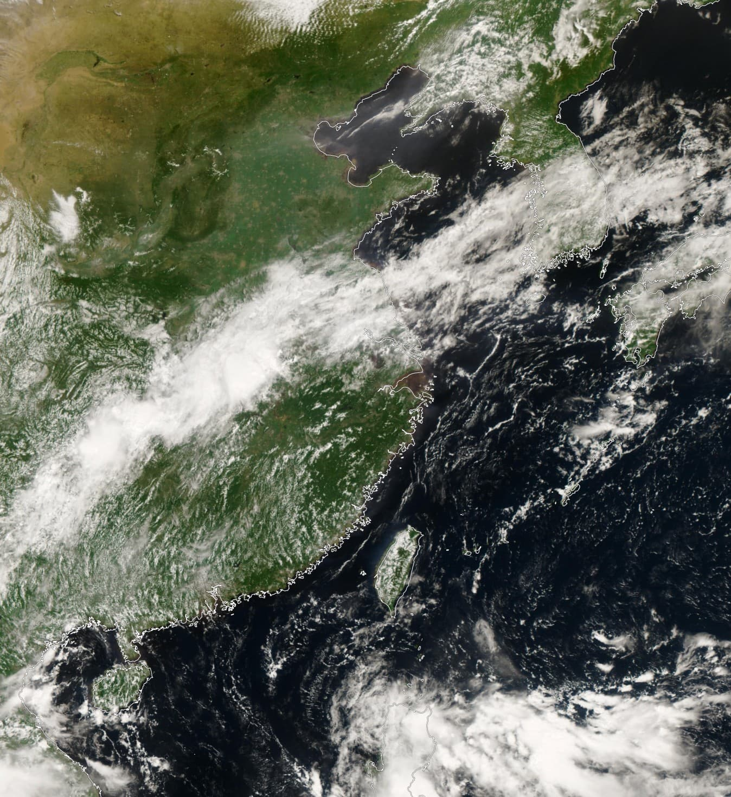

# FY-4B Tools: 卫星全圆盘图像处理流水线


一个完整的自动化工具链，用于获取、处理风云4B（FY-4B）卫星全圆盘图像，并将其切片为适用于 Mapbox / MapLibre 等网络地图库的地图瓦片。

### 最终产物示例
本项目可以将原始的卫星数据，处理成如下图所示的、带有高精度海岸线描边的精美地理图像，并进一步生成可交互的地图瓦片。



---

## ✨ 功能特性

- **全自动工作流**: 提供一个主控脚本 `main_workflow.py`，一键执行从下载到切片的完整流程。
- **定时与回补**: 主脚本支持守护进程模式，可每15分钟自动获取最新数据，并内置失败任务队列，在服务恢复后自动回补缺失的数据。
- **高并发下载**: 使用多线程并发下载原始瓦片，极大地缩短了数据获取时间。
- **智能图像处理**:
    - 自动拼接瓦片，并修正图像方向。
    - 自动裁剪图像周围的黑色内边距。
    - 支持手动进行像素级的向内裁剪或向外填充。
- **专业地理配准**:
    - 为图像赋予精确的风云4B地球静止轨道投影信息。
    - 将图像重投影并裁剪到指定的地理范围（默认为覆盖亚洲及澳洲的区域）。
    - 输出符合GIS标准、带透明通道的 GeoTIFF 文件。
- **精美可视化**: 可选地为最终图像叠加高精度（10m）的大陆海岸线，并带有白色描边和阴影效果，以增强视觉表现力。
- **高效地图切片**: 利用 GDAL 并行处理能力，将 GeoTIFF 文件高效地切片成标准的 `{z}/{x}/{y}.png` 地图瓦片。
- **Docker 支持**: 提供一个完整的 `Dockerfile`，将所有复杂的依赖（GDAL, Cartopy 等）打包，实现一键部署和跨平台运行。
- **高度可配置**: 通过命令行参数和 `.env` 文件，可以灵活配置工作流的每一个环节。

## ⚙️ 工作流概览

本项目由一系列独立的脚本组成，由 `main_workflow.py` 统一调度，数据处理流程如下：

```
1. download_stitch.py
   (输入: 时间戳)
   └─> fy4b_full_disk_{timestamp}.png (带黑边)
                               |
                               ▼
2. adjust_padding.py
   (输入: 上一步的.png)
   └─> fy4b_full_disk_{timestamp}_adjusted.png (已裁剪/填充)
                               |
                               ▼
3. create_geotiff.py
   (输入: 上一步的.png)
   └─> fy4b_full_disk_{timestamp}_adjusted_mercator.tif (已配准的GeoTIFF)
                               |
                               ▼
4. create_tiles.py
   (输入: 上一步的.tif)
   └─> /satellite_tiles/{unix_timestamp}/{z}/{x}/{y}.png (最终地图瓦片)
```
*(可选步骤 `add_boundaries.py` 可用于在切片前为 GeoTIFF 添加边界线)*

---

## 🚀 快速开始

我们强烈推荐使用 Docker 来运行本项目，因为它可以完美解决所有复杂的环境依赖问题。

### 方法一：使用 Docker (推荐)

**1. 构建 Docker 镜像**

在项目根目录下，运行以下命令：
```bash
docker build -t fy4b-processor .
```
这将创建一个名为 `fy4b-processor` 的本地镜像，其中包含了所有必需的系统库和 Python 包。

**2. 运行工作流**

在项目旁边创建一个 `data` 文件夹用于存放所有数据。然后运行容器：
```bash
# 运行默认工作流，自动处理最新时间戳的数据
docker run --rm -v "$(pwd)/data:/app/data" fy4b-processor

# 运行指定时间戳的数据
docker run --rm -v "$(pwd)/data:/app/data" fy4b-processor -t 20231027120000

# 作为后台守护进程长期运行
docker run -d --name fy4b-daemon -v "$(pwd)/data:/app/data" fy4b-processor
```
*   `-v "$(pwd)/data:/app/data"`: 将您本地的 `data` 文件夹挂载到容器的 `/app/data` 目录，所有处理结果都会出现在您本地的 `data` 文件夹中。
*   在 Windows CMD 中，请将 `$(pwd)` 替换为 `%cd%`。

### 方法二：本地环境设置

**1. 系统依赖**

- Python 3.12+
- **GDAL 核心库**: 这是最关键的依赖。
    - **macOS**: `brew install gdal`
    - **Ubuntu/Debian**: `sudo apt-get install gdal-bin libgdal-dev`
    - **Windows**: 推荐从 [Christoph Gohlke 的网站](https://www.lfd.uci.edu/~gohlke/pythonlibs/#gdal) 下载预编译的 wheel 文件，或使用 OSGeo4W。

**2. Python 依赖**

本项目使用 `uv` 进行包管理。
```bash
# 创建虚拟环境
uv venv

# 激活虚拟环境 (macOS/Linux)
source .venv/bin/activate

# 安装所有依赖
uv sync
```

---

## 🔧 配置

### `.env` 文件 (可选)

为了在 Windows 或非标准环境下指定 `gdal2tiles.py` 的路径，您可以在项目根目录创建一个 `.env` 文件：


windows安装 gdal 编译包
https://github.com/cgohlke/geospatial-wheels

```env
# .env.example
# 为 gdal2tiles.py 提供一个绝对路径
GDAL2TILES_PATH="C:\\Program Files\\GDAL\\gdal2tiles.py"
```
`create_tiles.py` 脚本会自动加载此配置。

---

## 📖 使用指南

### 主工作流脚本 (`main_workflow.py`)

这是与项目交互的主要方式。它集成了所有功能，并提供了丰富的命令行选项。

**基本用法**

```bash
# 自动查找并处理最新的数据
python main_workflow.py

# 处理一个指定的时间戳
python main_workflow.py -t 20250912073000
```

**常用参数**

- `-t, --timestamp`: 指定处理的时间戳 (YYYYMMDDHHMMSS)。
- `-d, --data-dir`: 所有数据的基础目录 (默认为 `./data`)。
- `--concurrency`: 下载瓦片时的并发线程数 (默认: 10)。
- `--crop-x`, `--crop-y`: 调整图像边距。正数向内裁剪，负数向外填充黑色边距。
- `--keep-files`: 保留所有中间生成的 `.png` 和 `.tif` 文件，而不是在处理后删除。
- `--zoom`: 生成的地图瓦片缩放级别 (默认: '1-7')。

**守护进程模式**

不带 `-t` 参数运行，脚本将进入守护进程模式，每15分钟检查并处理一次新数据，并自动回补失败的任务。
```bash
# 启动守护进程
python main_workflow.py

# 在 Docker 中作为后台服务运行
docker run -d --name fy4b-daemon -v "$(pwd)/data:/app/data" fy4b-processor
```

### 单独运行脚本 (用于调试)

您也可以按顺序单独运行每个脚本，这对于调试或自定义流程非常有用。请参考 `main_workflow.py` 中的调用顺序。

---

## 🏗️ 项目结构

```
.
├── Dockerfile              # Docker 配置文件
├── pyproject.toml          # 项目元数据和依赖定义
├── README.md               # 本文档
├── main_workflow.py        # 主控脚本 (推荐使用)
├── download_stitch.py      # 步骤1: 下载并拼接
├── adjust_padding.py       # 步骤2: 调整边距
├── create_geotiff.py       # 步骤3: 创建 GeoTIFF
├── add_boundaries.py       # (可选) 为 GeoTIFF 添加边界线
└── create_tiles.py         # 步骤4: 创建地图瓦片
```

---

## 🤝 贡献

欢迎提交 Pull Requests 或创建 Issues 来改进此项目！

## 📄 许可证

本项目采用 [MIT License](LICENSE)。